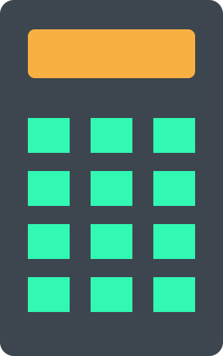

    

------------------------

    Simple calculator with graphical user interface, cross platform, easy to use using Java programming language and some Java library like Java awt and Java swing library.

 

## features
- Basic math operator
- Resizeable window
- Add previous number on top
- Decimal number support in calculator

## requirement
- Windows 7 and above
- Java JDK runtime 8 and above
